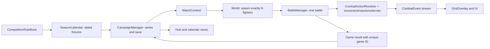

# Elemental Showdown: competition rules and tactical combat plan

This is an implementation plan, not a list of mechanics to add blindly. The player's decisions should change from game to game: whom to field, when to rest, where to stand, which existing skill form to use, and whether to spend a reaction or momentum. A best-of series is several **separate tactical battles on scheduled days**, not several rounds inside one battle.

The copied AI proposal is design input. It does not override the game's existing rules or the player's earlier direction: keep combat turn based; improve existing skills and their forms rather than creating new skill-tree entries; acquire skills and forms through SP in the skill tree; keep one player element at City level; preserve the Space/Time trophy gates. The proposed EX moment below empowers an equipped skill and adds presentation, not an unlockable new skill.

## 1. Existing code and constraints

| System today | What is already there | Gap to close |
| --- | --- | --- |
| `SeasonCalendar` / `CampaignManager` | 224-day, 32-week club season, 14 single-game league fixtures, one semifinal and one final | Store competition rules and series games on actual dates; advance brackets only after a series is decided. |
| `CampaignHub` / `World` | 1v1, 3v3 and 5v5 spawning, formation editor, one global `active_match_format` | Official fixtures must supply a locked format; launch must reject an incomplete lineup. The starting club has only three fighters. |
| `BattleManager` | Team turns, battle result, single shared resonance gauge, elemental fusion | Resolve a game once, return its result to the campaign, and coordinate telegraphs, reactions, and team-specific momentum. |
| `Player` / `Enemy` | Range bonuses, directional hits, knockback with a 12-damage boundary/unit collision, Brace/Riposte | Remove duplicated rule calculations, support multi-tile pushes, give the AI the same information and rules as the player. |
| `AbilityGeometry` / `BattleTerrain` | Name-based shapes; fire, ice, smoke and destructible earth wall | Add readable danger previews, layered surfaces and arena presets without changing skill identities. |
| `GridOverlay` / `UI` / `CareerCalendarPopup` | Attack/movement grids, battle HUD, monthly calendar and skip/jump controls | Show threats, reactions, terrain lifetimes, series score, required team size and all conditional game dates. |

The Continental Cup, national-team World Cup and Club World Cup currently have calendar/reward scaffolding but **not playable brackets**. Their format presets can be defined now; their playable series should be connected when those brackets exist. Never grant those trophies through a placeholder event.

## 2. Competition rules and season scheduling

These are initial, data-driven presets for playtesting. `team_size` means **exactly** that many eligible fighters on the field; it is not a maximum. `best_of` accepts only 1, 3 or 5, and wins required are 1, 2 or 3 respectively. Friendlies and street bouts can offer optional formats; a scheduled official fixture cannot be changed in deployment.

| Competition/stage | Team size | Series | Calendar consequence |
| --- | ---: | ---: | --- |
| Street duel | 1 | Single game | Current street flow stays intact. |
| Club friendly | 3 by default; optional 1/5 if both teams are eligible | Single game | Never affects standings or trophies. |
| City/Regional/National club league | 3 | Single game | Keep 14 league fixtures and current points/standings rules. |
| City/Regional championship semifinal and final | 3 | Best-of-3 | First team to two game wins advances. |
| National championship semifinal | 3 | Best-of-3 | Allows the five-fighter gate to arrive at the major final. |
| National Cup final | 5 | Best-of-5 | First team to three game wins receives the existing National title/Space-Time choice. |
| Future Continental Cup / Club World Cup knockout | 5 | Best-of-3; final best-of-5 | Apply once those club brackets are playable. |
| Future national friendlies | 3 by default | Single game | Use a separate eligible national roster. |
| Future national continental cup / World Cup | 5 for knockout; group rules defined per fixture | Best-of-3 semifinal; best-of-5 final | National World Cup is distinct from Club World Cup. |

The proposed postseason slots fit inside the current 224 days: semifinals on season days **199, 202, 205**; finals on **210, 213, 216, 220, 223** (use only the first three for a best-of-3 final). This leaves at least two open days between most games for training or rest. The existing week-31 national window would collide with the final, so move that optional window to an open pre-postseason week such as week 25. A scheduling test must prove no required national or club match shares a day for the same athlete. The week-30/week-32 text currently used for postseason should be replaced with these dated events. All dates are decided before a series starts; later games display “if needed.” When a team clinches, mark remaining dates “not needed,” preserving their history rather than silently deleting them.

The current single-week national windows are placeholders and cannot hold an entire continental cup or World Cup. When those brackets become playable, the scheduler must reserve a multi-week national block in eligible seasons (continental every two seasons, World Cup every four), then shift affected club fixtures to verified free dates or put the national block in the offseason. The scheduling service rejects any plan that exceeds the club season or double-books a selected player; it never silently advances a club fixture. The player sees these dates before deciding whether to rest, train or accept a call-up.

Promotion and relegation stay based on the current regular-season table until the user deliberately changes that rule. A series decides the championship and associated trophy; it does not add several standings entries. Simulate every non-player semifinal/final by the same best-of reducer with a seeded result per game, rather than automatically choosing the higher seed.

The club must be able to field five before a mandatory 5v5 fixture appears. Add a roster-readiness milestone well before National postseason: show the requirement in the hub, make recruitment possible during the appropriate window, and provide a clearly labeled emergency club signing/loan if the roster would otherwise deadlock. National-team matches use the national squad, not the club's `allies` array. At launch, validate five distinct, available and legally placed fighters; do not spawn three allies against five enemies or secretly insert fallback fighters into a career match. Allow bench substitutes under the fixture's stated substitution limit. Between games the player may change lineup and formation; battle-local HP/MP reset, while career energy/fatigue and any implemented persistent injury/availability carry across dates.

Skipping one scheduled series game simulates/forfeits **that game only**, advances its date, and may end the series if the opponent clinches. It does not grant played-game rewards. “Skip entire series” would need its own explicit control if later desired. The existing Jump to Match action jumps to the next *unresolved game*, not to the entire series end.

## 3. Object-oriented layout and data flow

Use small domain classes with one owner for each rule. Keep Godot scene nodes for actors and presentation; use `RefCounted` objects for runtime rules/state and dictionaries only at the JSON save boundary. Do not rebuild `Player` and `Enemy` around a new inheritance hierarchy in one step; both can delegate to shared resolvers through `BattleManager` while retaining their animation and input code.

| New class/file | Responsibility and public contract |
| --- | --- |
| `scripts/match_rules.gd` (`RefCounted`) | Validated, read-only-at-runtime snapshot: competition/stage ID, team size, best-of, substitutions, arena preset, optional edge rule, round/overtime limits, date spacing and reward policy. `to_dict()`/`from_dict()` for saves. |
| `scripts/competition_rule_book.gd` (`RefCounted`) | Factory for named rule presets. The fixture copies the chosen rules when scheduled so later catalog edits do not rewrite a season already in progress. |
| `scripts/series_state.gd` (`RefCounted`) | Series ID, teams, scheduled days, current game index, per-team wins, recorded game IDs/results, winner, cancellation status and limited between-game scouting memory. `record_game()` rejects duplicate IDs and games after a clinch. |
| `scripts/match_context.gd` (`RefCounted`) | Immutable launch snapshot: fixture/series/game IDs, date, two teams, rules, seed and arena ID. `World` and the HUD read this instead of a mutable global format. |
| `scripts/combat_action_resolver.gd` (`RefCounted`) | One legal action pipeline for player and enemy hits: cost, shape, range bonus, hit check, damage, statuses, fusion, movement, terrain, momentum and events. Migrate one action path at a time. |
| `scripts/force_movement_resolver.gd` (`RefCounted`) | Tile-by-tile push, occupancy, boundaries, structures, collision damage/stagger and terrain entry. Returns a result; it does not choose animations or alter career state. |
| `scripts/attack_intent.gd` (`RefCounted`) | Frozen telegraph snapshot: caster ID, existing skill/form ID, origin, target tiles, resolve phase and interrupt conditions. No arbitrary executable callbacks in saved data. |
| `scripts/reaction_resolver.gd` (`RefCounted`) | Once-per-round Guard/Counter/Intercept/Overwatch eligibility, resource costs, trigger order and recursion guard. |
| `scripts/combat_event.gd` (`RefCounted`) | Structured event for HUD, log, animation and tests: actor, source skill/form, affected tiles, amounts, status changes, interrupt reason. |
| `scripts/game_result.gd` (`RefCounted`) | One immutable game outcome: game ID, winner/draw, turns, judge score and played/skipped flag; the campaign calculates rewards and accepts it once. |
| `scripts/enemy_tactics.gd` (`RefCounted`) | Scores legal action/position/intent/reaction candidates from visible board state and prior series observations; never applies damage or reads undisclosed player choices. |

`BattleManager` remains the **single battle coordinator**. `CampaignManager` remains the **single persistent career owner**. `SeasonCalendar` owns deterministic fixture and day generation. `World` is the composition root that builds the arena and fighter nodes from one `MatchContext`. `UI` and `GridOverlay` render state/events; they never decide hits, series outcomes or rewards. Inject one seeded `RandomNumberGenerator` into the battle and AI services so a test can reproduce a turn without relying on global random state.

The key OOP idea is to keep series rules *inside* `SeriesState`, so no HUD or battle script can increment wins directly. Its core can be this small; `CampaignManager` additionally checks that `game_id` is the expected scheduled game before calling it:

```gdscript
class_name SeriesState
extends RefCounted

var best_of: int # Validated as 1, 3, or 5 when constructed/loaded.
var _wins := [0, 0] # Home, away.
var _recorded_game_ids: Dictionary = {}

func wins_needed() -> int:
	return int(best_of / 2) + 1

func record_game(game_id: String, winning_side: int) -> bool:
	if game_id.is_empty() or winning_side not in [0, 1]:
		return false
	if _recorded_game_ids.has(game_id) or is_complete():
		return false
	_recorded_game_ids[game_id] = true
	_wins[winning_side] += 1
	return true

func is_complete() -> bool:
	return _wins[0] >= wins_needed() or _wins[1] >= wins_needed()
```

That class answers “who won the series?”; it does not pay XP, load a scene or draw a scoreboard. `CampaignManager` stages the state change, saves it, and returns a read-only result for the UI. If the save fails, restore the pre-result state and report the failure rather than displaying a victory that cannot be reloaded.



The permanent save contains plain JSON-compatible values: a `save_version`, the existing season data, a `series` dictionary keyed by stable series ID, and an optional active match context. A game ID should be derived from season, competition, series and game index, not a fresh random value on every launch. Save/load validates rules, dates, team names, win totals and unique recorded game IDs **before** assigning to the live campaign; a legacy save without series fields migrates to single-game fixtures and keeps its existing results. Continue using the current temporary-file/rename save path.

`CampaignManager.complete_game(result)` must be atomic and idempotent: validate the active game ID, apply **one** game result, apply per-game energy/XP, update the series, award a series title only on clinch, choose the next dated game or stage, then save. The result screen reads a snapshot of that outcome. A post-result “Restart Match” must not replay a recorded game for new rewards; change it to a no-reward exhibition replay or remove it for official results. `BattleManager` must not directly increment league standings or grant a trophy. Existing standings are updated once per single-game league fixture; knockout games never add league points. Use modest per-game XP with a series-level cap, one series completion reward, and no rewards for skipped games so losing deliberately to create Game 5 is not a good farming strategy.

Series opponents should learn only from **observed** prior games: the share of close/mid/long attacks used, favored lane, frequent terrain and vulnerable roster positions. `SeriesState` keeps a compact summary, and `EnemyTactics` can alter its formation/action weights by a bounded amount (for example, 10–20%) in Game 2+. The opponent may choose a different legal existing loadout or formation, but does not read the player's next lineup or receive secret stat boosts. Show a scouting hint such as “They adapted to your long-range pressure,” so a changed matchup feels earned rather than arbitrary. Arena variation also comes from a disclosed fixture preset/seed, not a hidden mid-series rules change.

## 4. Combat mechanics and exact resolution rules

### A. Shared action order

Both sides use the same order: validate turn/actor/skill/targets and pay a cost once; lock the chosen form's geometry and range band; resolve or queue a telegraph; check line of sight and each target's hit chance; apply damage and existing statuses; trigger one elemental reaction if eligible; apply forced movement and collisions; react with/place terrain; update momentum from actual events; check all KOs after the complete multi-target action; publish events for the HUD. An evaded hit cannot apply burn, fusion, knockback or **attacker** momentum. The action resolver returns data; animations play from its events and are awaited at the already readable movement/impact pace.

For optional buzzer-beater/overtime rules, a fixture can declare a full-round limit (initial tuning value: 12). At that limit, ordinary league games can end in a draw, using the existing one-point standings rule. Knockout/series games cannot draw: play up to two announced overtime rounds where a KO ends the game; if no KO occurs, judges compare surviving fighters, aggregate remaining HP fraction, then damage dealt. Record the judge decision and its factors in the result modal. Do not use an unexplained sudden damage multiplier. The limit is a competition rule shown before deployment, and it is disabled until tests prove that normal battles rarely hit it.

Keep existing skill IDs, names, unlocks and three-form structure. Add small form metadata only where the name/behavior supports it: `push_tiles`, `windup_rounds`, `terrain_kind`, `reaction_tag`, or an existing range/shape field. The existing `AbilityGeometry` remains the one source for target tiles, so preview, actual hits, AI scoring and telegraph zones agree. A form's close/mid/long +25% sweet spot is preserved and displayed before selecting a target.

### B. Knockback, walls and collisions

The current one-tile knockback and 12-damage collision are a starting point. A shared resolver walks **one tile at a time** for forms that already imply push force; each step checks arena boundary, fighters, earth wall and blocking terrain. It stops at the first obstacle, records the actual path, then applies one impact event. A fighter-to-fighter collision damages both; a wall impact damages the pushed fighter and optionally the destructible wall. Corner positioning matters because it changes the collision destination. At most one collision-damage packet and one stagger per target per action; stagger cannot indefinitely chain-stun. No friendly-fire collision damage unless the fixture rules explicitly say so. An adjacent teammate's “rebound assist” can later be a once-per-round reaction using an existing basic attack, never a new unlocked skill. Normal boundaries cause collision; a labeled arena preset may use ring-out instead. The UI previews push arrows and the likely collision square, and the AI includes collision value in its positioning score.

### C. Telegraphed existing attacks

Flag a few high-impact **existing forms**, not new attacks, with `windup_rounds = 1`. When used, the caster pays/reserves the cost, fixes origin/target area, displays an intent, and spends that turn's attack. The marked tiles stay visible through the opposing team's next turn. At the start of the caster team's following phase, resolve the frozen area **instead of** giving that fighter an additional attack. A knockout, stun, forced displacement or destroyed required terrain cancels the intent; simple target movement does not retarget it. The player can move away, block, knock the caster aside, or accept the hit to pursue a different goal. If a player-owned form has the same windup, the same delay and cancel rules apply. Telegraphs never hide behind the action log; show an icon, skill name, countdown and patterned danger tiles. Start with at most one telegraphing enemy in a 3v3 turn, then tune frequency from playtests.

### D. Elemental primers and detonations

Keep existing fusion definitions in `ElementData`, but replace the current “previous elemental action against the same target” shortcut with a target-owned primer token that lasts through one opposing/team response window. A primer is placed only by a **landed** elemental hit. A compatible later hit from a different teammate consumes it and triggers exactly one reaction, including the current bonus damage. Suggested reaction behaviors are Water + Lightning: a small adjacent arc and short shock; Water + Fire: vapor/accuracy penalty; Fire + Earth: short-lived molten/fire terrain; Air on an existing burn/wet/chill: spread only to adjacent legal targets. Define the exact pair table in data, cap chain targets, and mark reaction damage as non-priming so it cannot recurse. AI plans both setup and detonation, and the HUD shows the primer icon, remaining window and possible follow-up. This team reaction is **not** the same as unlocking a two- or three-element skill from the SP tree.

### E. Terrain and arena presets

Evolve `BattleTerrain` from one hazard dictionary per tile into clear layers: structure (e.g. earth wall), surface (fire/ice/water), and obscurant (smoke). Each layer owns duration/HP and collision/movement/accuracy effects. Preserve existing fire stacking/expiry, water/ice extinguishing, ice movement cost, smoke sight penalty and permanent-until-destroyed earth walls. Add puddles and any hazard from **existing named forms** or a declared arena preset only after reactions are specified; do not make every water attack leave a puddle by default. Define deterministic interaction order: direct hit, extinguish/transform existing surface, place new surface, then advance durations once per full round. A water hit can clear fire even if it misses a fighter, but a missed attack cannot prime that fighter. Show wall HP, surface turn counts and a small terrain legend on hover.

Arena presets are data (initial tiles, active vents/fences, edge rule, visual palette) selected by fixture/seed. Normal official league arenas should not introduce hidden random hazards. A special arena's hazardous edge or timed vent must be named in the match rules and previewed in deployment. Never place an opening hazard under a fighter or seal both teams behind a permanent wall. Keep battle terrain local to one game; only campaign fatigue/availability crosses series dates.

### F. Crowd momentum and reactions

Use the existing resonance system as **one team-specific Crowd Momentum resource**, instead of adding a second gauge. Each side has 0–100. Reward real counter-hits, completed team reactions, meaningful displacement and surviving a telegraphed attack; limit gains per action and give none for repeated free support casts or hitting an invulnerable object. A passive team turn can lose a small amount. Crossing 50 grants one clearly shown, modest once-per-round “Crowd Roar” movement benefit. At 100, the player may spend the gauge to empower the **next already equipped** attack/support form (for example +20% damage/healing or one additional terrain turn); AI uses it under the same rules. The empowered action gets a strong animation/banner, not a new skill ID, SP unlock or extra free turn. Reset both gauges at each new series game. Playtest the numbers for runaway leaders.

Guard/Brace and Riposte already exist. Give a unit a clearly labeled end-turn reaction choice: Guard (damage reduction and push resistance); Counter (one legal basic counter when attacked at close range); Intercept (a defender protects a selected nearby ally if a legal route exists); Overwatch (reserve an equipped ranged attack and its MP for the first enemy entering its legal pattern). A reaction costs the unit's attack opportunity, has one trigger per round, and cannot trigger another reaction or elemental chain from its own automatic hit. Resolve triggers in a documented order: Overwatch on movement into its pattern; Intercept when an attack selects its protected ally; Guard at impact; Counter only after its owner survives the hit. Both player and AI can use the same resolver; the AI should weigh saving a vulnerable teammate against spending its attack. Keep reaction controls outside the skill tree because these are universal combat orders, not acquired elemental skills.

## 5. UI and teaching the player

| Screen | New information and interaction |
| --- | --- |
| Hub schedule card | Competition/stage, opponent, **3v3/5v5**, **single/Bo3/Bo5**, current series score, game number and next date. A clinched series reads “Won/Lost series” rather than “next game.” |
| Monthly calendar popup | Actual reserved day cells for every potential series game: “G1,” “G2,” “G3 if needed,” etc. Use played/win/loss/next/if-needed/not-needed states, an accessible symbol plus color, tooltip with format and opponent, and Jump to Next Game. Rest/training still advances days normally. “Skip Game” says exactly which game is simulated. |
| Deployment | Official format buttons become a read-only rules badge. Show required/deployed/eligible counts, substitution cap, injury/energy warnings, game date and series score. Disable Launch with a concrete reason until **exactly N** eligible positions are set. Allow lineup/formation changes between games. Show arena modifier and any ring-out rule before launch. |
| Battle HUD | Series header (`National Final · Game 2 of 5 · 1–0`), separate team momentum bars, visible reaction choice/remaining trigger, nearby primer/status icons, terrain duration/HP hover, and upcoming attack intent with countdown. The ability tooltip states target shape, close/mid/long sweet spot, push distance, windup and terrain effect. |
| Grid overlay | Keep blue movement and orange player targeting. Add a separate patterned red enemy-danger layer that remains visible while the player selects movement/skills; show impact arrow/collision icon and an origin marker. Do not convey danger by red color alone. Never make threat tiles look like clickable player attack tiles. |
| Result modal | Distinguish **Game result** from **Series result**. Show updated W–L tally, games remaining/clinched, next date, energy change and once-only rewards. “Return to Hub” is the primary button; any replay is explicitly reward-free. |
| Scouting / help | For future opponents, show competition format, known arena rules and observed tactical tendencies without revealing hidden AI decisions. Add short first-use explanations for telegraphs, reactions, primers and the series score. |

Build the new UI as small reusable controls or helper scenes where that reduces duplication (`SeriesScoreBadge`, `MatchRulesCard`, `IntentBadge`, `MomentumBar`) and keep `CampaignHub`/`UI` responsible for placement and data binding. A UI element takes a read-only view model or combat event; it does not mutate `CampaignManager` except through an explicit button command. Reuse the current visual theme and assets first, then capture screenshots at the canonical 1920×1080 size and a smaller viewport to catch clipping.

## 6. File boundaries

**Edit deliberately:**

| Existing file | Intended change |
| --- | --- |
| `scripts/season_calendar.gd` | Dated series slots, event metadata, conflict checks, non-player series simulation inputs. Keep its deterministic round-robin and standings calculation. |
| `scripts/campaign_manager.gd` | Active context, series save/load/migration, exact-roster eligibility, skip-one-game, idempotent completion, bracket/trophy transition. Keep it the sole XP/reward owner. |
| `scripts/campaign_hub.gd` and `scripts/career_calendar_popup.gd` | Rules/series presentation, deployment gate, scheduled game dates, skip/jump wording and buttons. |
| `scripts/world.gd` | Build the arena and exactly-sized teams from `MatchContext`; remove dependence on the global official-match format. |
| `scripts/battle_manager.gd` | Turn timing, action/intent/reaction coordination, per-team momentum and one battle-result handoff. |
| `scripts/player.gd` and `scripts/enemy.gd` | Delegate shared hit/push/reaction calculations to resolvers; retain input/AI animation and actor-specific state. Avoid simultaneous large rewrites. |
| `scripts/ability_geometry.gd`, `scripts/battle_terrain.gd`, `scripts/grid_overlay.gd` | Shared tiles, layered terrain rules and readable danger/impact overlays. |
| `scripts/element_data.gd` | Metadata for selected **existing** skill forms and compatible elemental reactions. Do not add skill IDs or bypass SP. |
| `scripts/ui.gd` | Intent, momentum, reaction, tooltip and game/series result views. |
| `scripts/test_*.gd`, `README.md` | Focused regression/contract tests and player/developer documentation. |

**Leave alone unless a demonstrated dependency requires a small change:** `main_menu.gd`, `character_customization.gd`, `skill_tree_canvas.gd`, `settings_manager.gd`, `scouting_catalog.gd`, the character sprite sheets and unrelated assets. Do not rewrite `World.tscn`/`CampaignHub.tscn` just to move logic that is already constructed in their scripts. Do not change the 72 skill identities, three-form progression, starter support/attack pair, SP-only acquisition, element unlock thresholds, Space/Time trophy gates, nationality rules, league round-robin count, or existing player saves by hand. Never edit the user's original GDD or copied AI text as though it were game code.

## 7. Build order and completion gates

1. **Baseline and contracts.** Run existing tests; record current screenshots. Add `MatchRules`, `SeriesState` and their unit tests. Agree on fixture IDs and save migration before UI work. Gate: old saves still load, invalid rules are rejected, single-game fixtures act exactly as before.
2. **One 3v3 best-of-3 vertical slice.** Schedule one club semifinal series on the three reserved dates; lock official format, show score/calendar, support play/skip, and save after every game. Gate: a 2–0 series cancels G3, a 1–1 series reaches G3, duplicate results cannot advance twice, rest/training between dates work.
3. **Roster and major final.** Implement exact eligibility, recruitment readiness/emergency fallback, 5v5 National final and best-of-5 dates. Gate: no 3v5 launch, five-player lineup and bench work, title/reward occurs once at three wins, no schedule collision. Only then enable the 5v5 preset for future cups.
4. **Single combat action path.** Extract hit/range/status/geometry calculation in small steps. Gate: player and enemy produce the same result for the same action and seed; existing range and shape tests stay green.
5. **Physical board and telegraphs.** Share force movement, add collision preview, then add one or two telegraphed forms and cancellation. Gate: animations finish before the next action, warning area matches actual hit area, and the telegrapher does not attack twice.
6. **Combos, terrain and arena rules.** Move fusion to primer tokens, layer surfaces and structures, and introduce a small number of transparent arena presets. Gate: reactions do not recurse, terrain duration/clear/destruction agree for player and AI, no unwinnable starting layout.
7. **Momentum and reactions.** Convert resonance to per-team Crowd Momentum and add shared Guard/Counter/Intercept/Overwatch orders. Gate: no free-skill farming or reaction loops; both teams can use the same rules.
8. **Polish and balance.** Add first-use explanations, varied opponent tactics and series result presentation. Connect the presets to future Continental Cup, Club World Cup and national-team brackets when those modes are playable. Gate: playtesters understand why they were hit, can identify at least two meaningful alternatives to their first move, and do not report Bo3 as three indistinguishable battles.

## 8. Verification after each implementation phase

Run focused headless tests while working, then the full suite with the repository runner:

```powershell
.\scripts\run_tests.ps1 -GodotPath 'D:\USB\Games\Godot_v4.5.1-stable_win64.exe\Godot_v4.5.1-stable_win64_console.exe'
```

Add dedicated `test_match_rules.gd`, `test_series_state.gd`, `test_match_scheduling.gd`, `test_combat_intents.gd`, `test_force_movement.gd` and `test_reaction_rules.gd` suites where the new domain logic justifies them. Extend existing season, campaign, multi-unit, tactical arena, skill form, combat regression and multi-save suites rather than duplicating all their fixtures. The important checks are:

- **Series/career:** Bo3 ends at 2–0 or 2–1, Bo5 at 3–0/3–1/3–2; no extra games after clinch; game and series results are distinct; a skipped game has no played rewards; replaying the same ID or reloading after a result cannot duplicate XP, money, title or standings; old saves migrate and corrupt series data does not partially load; a failed save rolls back the in-memory result.
- **Calendar:** Dates are visible before Game 1, spaced for rest, do not collide with national commitments, and remain inside 224 days; jump, rest, train and skip cannot cross an unresolved required game; “if needed” cells become “not needed” correctly.
- **Roster:** Exactly 1/3/5 eligible units appear on **both** sides; duplicate, benched, injured or off-grid names fail launch; 5v5 has a reachable roster solution before it becomes mandatory; substitute limits persist within each game and reset for the next.
- **Combat legality:** Skill preview = actual affected tiles = AI evaluation; close/mid/long bonus applies at the displayed distance; a missed hit gives no status/primer; telegraph has a full response turn, can be interrupted, never retargets secretly or gives a second action; wall and fighter collisions resolve one tile at a time and cannot trigger infinite damage/status loops; league round-limit draws and knockout overtime/judges follow the displayed rules.
- **Terrain/reactions:** Fire stacks to its cap and is quenched, ice slows, smoke obscures, earth wall survives until destroyed; layered effects have deterministic priority; primer is consumed once; both team gauges are independent; reactions trigger at most once and use legal resources.
- **Presentation:** Inspect the monthly calendar, deployment, battle HUD and result modal at 1920×1080 and a smaller window; text does not clip, danger is distinguishable without color, touch/click targets do not overlap, animation and impact are visible without relying on the bottom-left log.
- **Balance/playtest:** Run a City Bo3, a National Bo5, a skipped game, a deliberately tired lineup, and an AI vs AI final. Record game length, use of different forms, reactions, telegraph escapes, win rates and whether later series games cause lineup/positioning changes. Tune numbers and frequency only after these observed runs.

Finish with `git diff --check`, a clean Godot parse/import, the full headless suite, manual F5 smoke for old and new careers, and a read-through of the save migration and reward call sites. The pass criterion is not merely that a series reaches Game 5: it must add decisions the player can see and understand without weakening the established progression rules.
